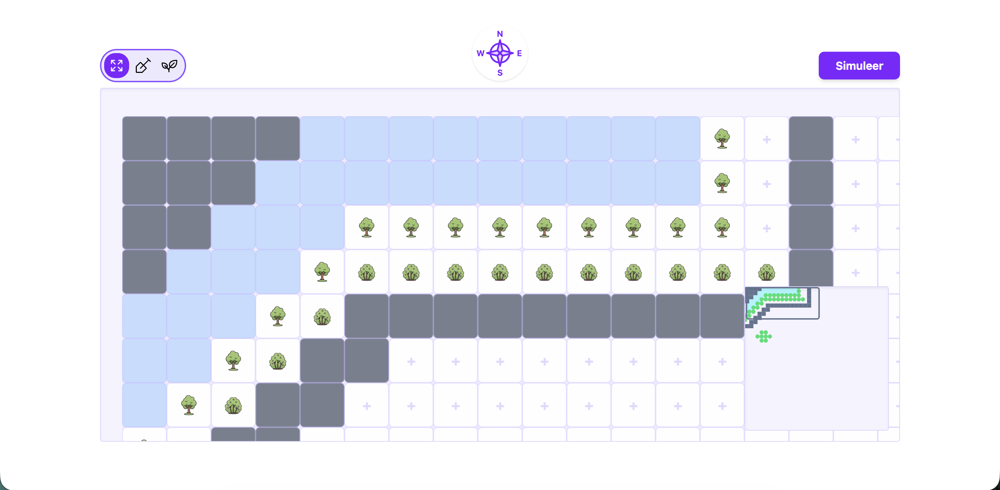

# 🌳 Forest Garden Builder

A web-based interactive tool for designing, planning, and simulating permaculture forest gardens. Built with the latest web technologies to provide a performant, infinite-canvas experience.


*(Add a screenshot of your builder here)*

## ✨ Key Features

- **Infinite Canvas Navigation**: A custom-built viewport system allowing users to drag and pan across large garden plots.
- **Terraforming System**: Modify the landscape by adding water features (ponds/rivers) or marking terrain as unusable.
- **Interactive Minimap**: A high-performance minimap built with **Konva (HTML5 Canvas)** that provides a real-time, scaled overview of the forest with a viewport overlay.
- **Planting System**: Place specific plants with distinct attributes (Height, Habit, etc.) onto the grid.
- **State Persistence**: Smart state handling that remembers your scroll position and selection even when navigating menus.
- **Simulation**: (In Progress) Analyze the garden layout against environmental elements.

## 🛠️ Tech Stack

- **Framework**: [SvelteKit](https://kit.svelte.dev/) (Full-stack capabilities)
- **UI Library**: [Svelte 5](https://svelte.dev/) (Using the new **Runes** system: `$state`, `$derived`, `$props`)
- **Styling**: [TailwindCSS](https://tailwindcss.com/)
- **Components**: [Bits-UI](https://bits-ui.com/) (Headless accessible components)
- **Graphics**: [Svelte-Konva](https://konvajs.org/) (For the high-performance minimap)
- **Icons**: [Phosphor-Svelte](https://phosphoricons.com/)

## 🏗️ Technical Architecture

### 1. The Canvas (Viewport Pattern)
Instead of a traditional scrollbar approach, the application uses a **Viewport/Content** pattern. 
- The **Outer Container** has `overflow: hidden` and captures mouse events for custom "drag-to-scroll" logic.
- The **Inner Grid** renders the cells.
- **State Lifting**: Scroll positions are bound to the parent page, ensuring the user doesn't lose their place when switching context.

### 2. Data Structure (Sparse Grid)
To ensure performance with large grids, we moved away from 2D Arrays.
- **Structure**: `Record<number, TerrainType>` and `Record<number, PlacedPlant>`
- **Why**: This allows for O(1) lookups and efficient "sparse" storage (we only store cells that have data, not empty ones).

### 3. State Management
The application uses a **Singleton Store Pattern** (`forestStore.ts`) on the server.
- This acts as an in-memory database wrapper.
- It separates the **Domain Logic** (The `Voedselbos` class) from the **API Logic** (SvelteKit Actions).

## 🚀 Getting Started

### Prerequisites

- npm
```sh
# Install the latest version of Node Package Manager
npm install npm@latest -g
```

### Installation
1. Clone the repo
```sh
git clone https://github.com/FalloutCS/voedselBosApp.git
```

2. Install NPM Packages
```sh
npm install
```

3. Change git remote url to avoid accidental pushes to base project
``` sh 
git remote set-url origin github_username/repo_name
git remote -v # confirm the changes
```

### Running
Once you've installed the project and dependencies with `npm install` (or `pnpm install` or `yarn`), start a development server:

```sh
npm run dev

# or start the server and open the app in a new browser tab
npm run dev -- --open
```

## Developing

Once you've created a project and installed dependencies with `npm install` (or `pnpm install` or `yarn`), start a development server:

```sh
npm run dev

# or start the server and open the app in a new browser tab
npm run dev -- --open
```

## 👥 Authors
Ruben Verhoef - Lead Developer
Tine Sui - Frontend/Design